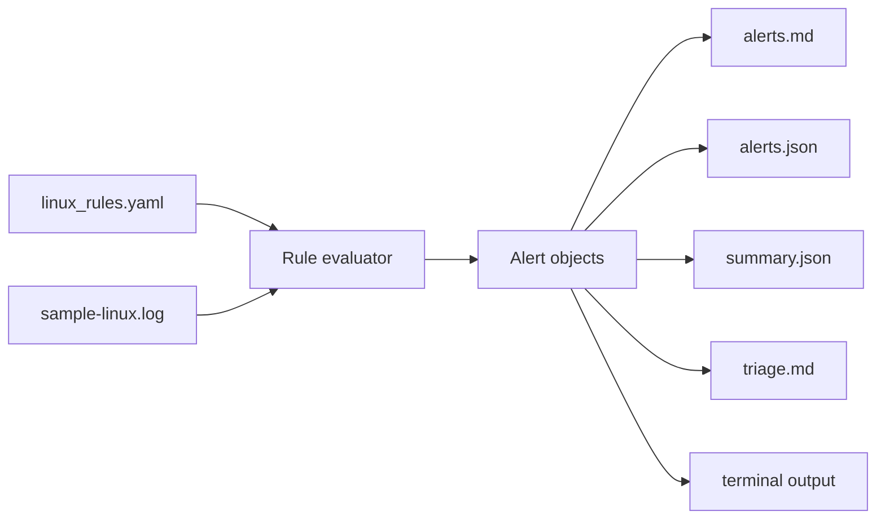

# Architecture

Custom IDS Script is a defensive Linux log rule runner for local detection labs.

## Current MVP

- Loads simple YAML-like Linux IDS rules.
- Evaluates sample Linux log lines.
- Emits alerts for failed SSH logins, suspicious shell commands, and new users.
- Adds timestamps and recommended response actions.
- Writes alert, summary, and triage artifacts.

## Future Product Shape

- Tail-follow mode with checkpointing.
- Suppression workflow for expected admin activity.
- Slack/webhook alert delivery.
- Rule metadata with MITRE mapping and severity tuning.
